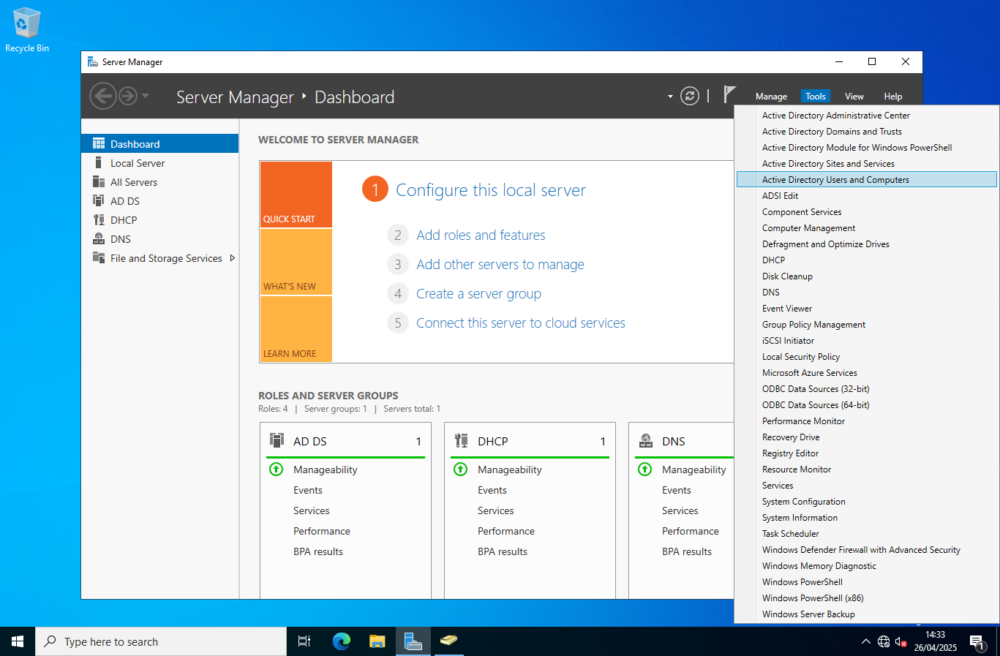
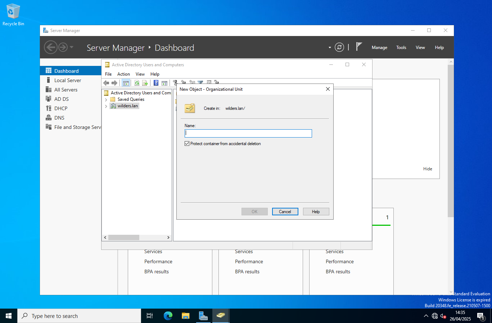
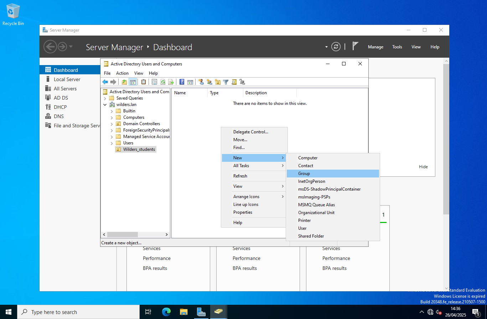
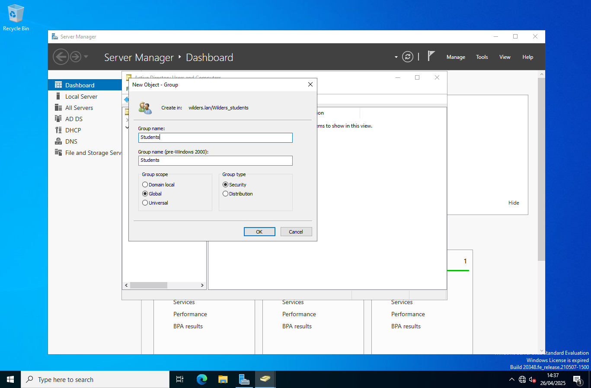
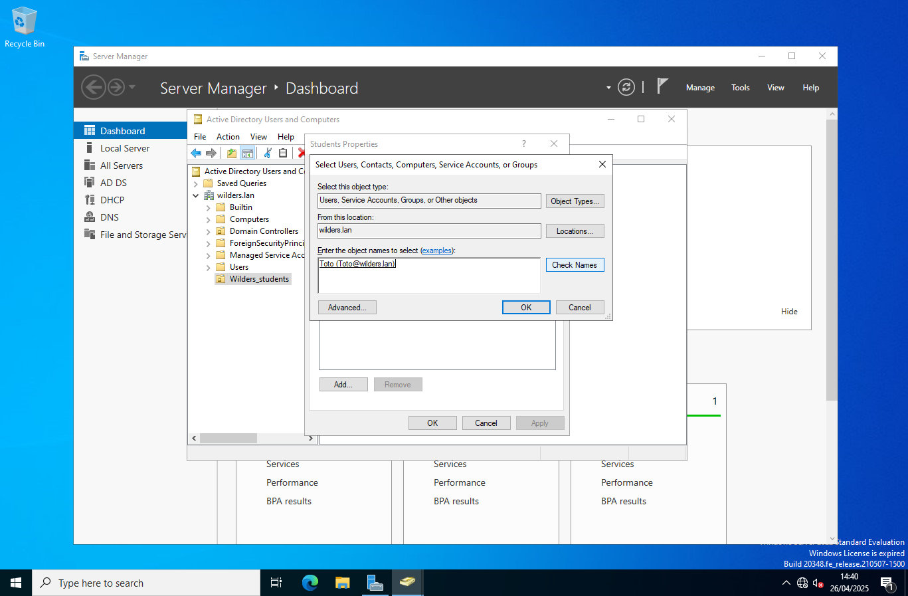
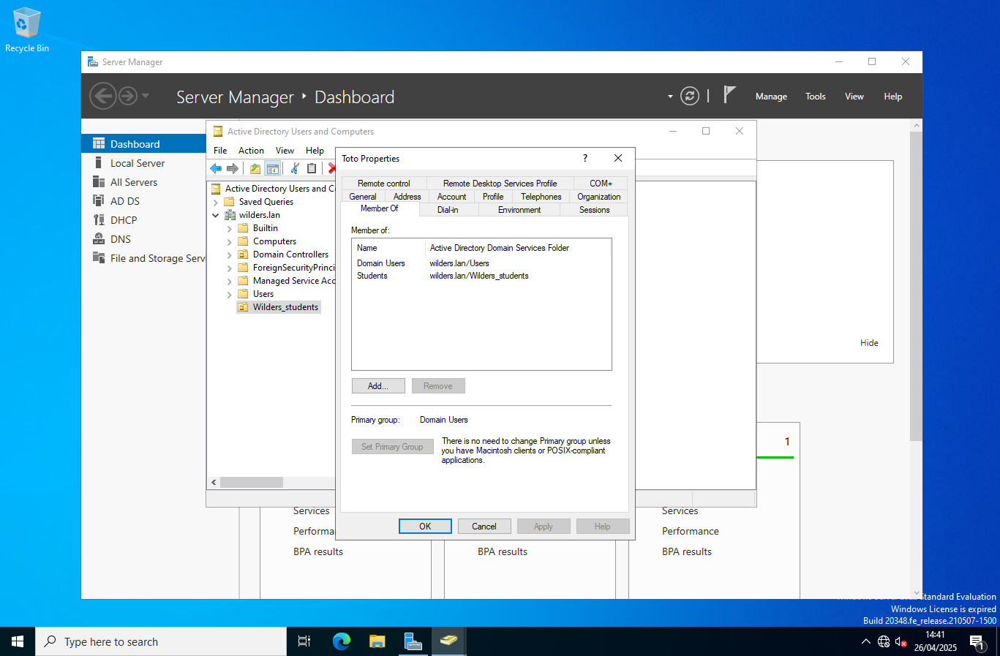

# **Prérequis :**
> _Vous devez avoir fini les quêtes précédentes pour pouvoir effectuer les étapes suivantes !_

### Création de l'unité d'organisation ``Wilders_students``

#### 1). Rendez-vous dans votre ``Server Manager``, cliquer sur ``Tools`` et choisissez l'option ``Active Directory Users and Computers`` comme suit =>

#### 2). Une fois sur votre menu déroulant, cliquez droit sur votre nom de domaine correspondant ici ``wilders.lan`` => ``New`` => ``Organizational Unit`` et renseigné le nom de votre nouvelle unité d'organisation =>

#### 3). Allez dans votre unité d'organisation nouvellement crée puis cliquez droit dessus ou dedans => ``New`` => ``Group`` pour procédée à la création du groupe d'utilisateur, dans notre cas nous allons crée un groupe ``Students``. =>

#### 4). Un menu s'affiche alors pour la création de votre groupe utilisateur, renseigné le nom et laisser les options tels quels =>

#### 5). Votre groupe utilisateur est désormais crée nous allons donc ajouter un nouvel utilisateur à celui-ci. Pour cela comme pour le groupe, cliquer droit dans l'unité d'organisation ou dessus puis ``New`` => ``User``. Une fenètre s'affiche pour renseigné les informations utilisateurs, dans notre cas nous allons crée ``l'étudiant Toto`` avec comme nom de connexion ``Toto`` =>

> Renseigner un mot de passe de connexion pour l'utilisateur

> Puis terminer la création en cliquant sur ``Finish``

#### 6). Il ne reste plus qu'a ajoutez le nouvel utilisateur dans le groupe utilisateur pour cela il y a plusieurs façons, soit faire un clic droit sur l'utilisateur et dans les propriété l'ajoutez directement au groupe correspondant ou bien ouvrir le groupe utilisateur en double cliquant , dans propriété choissisez ``Members`` => ``Add`` => Entrez le nom de l'utilisateur et complèter avec le bouton ``Check Names`` puis validez =>

#### FIN . Vous venez de crée une unité d'organisation dans laquel vous avez crée votre groupe d'utilisateur et rattacher un utilisateur à ce dernier !

> Propriété de l'utilisateur Toto

>
